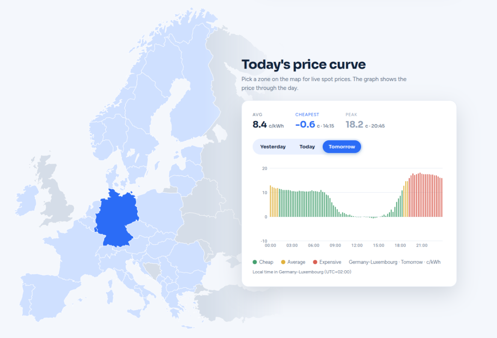

# SpotBuddy

Automates household energy consumption around day-ahead electricity spot prices. Keep your supplier,
keep your devices; this is the brain that decides when things switch on.



## What it does

* **Works with Shelly and Home Assistant.** Shelly scripts ship in the repo, and Home Assistant drives
  the same scheduling endpoint. No hardware to buy, no supplier to switch.
* **Day-ahead spot prices** for 45 European bidding zones, refreshed daily.
* **Every hour classified** as cheap, average or expensive, judged against its own zone.
* **Interactive map:** pick a zone, see yesterday, today and tomorrow.
* **Scheduling API:** ask for "4 hours before 6am", get back the cheapest blocks.
* Prices in c/kWh in the zone's own local time.
* Weather per zone, feeding the classification and thermal scheduling.

## Components

* **React, TypeScript, Vite and MUI.** The web app. Built to static files and served by nginx.
* **ASP.NET Core.** Owns the REST surface, the database and the external clients, and runs a
  background job that fetches tomorrow's prices each afternoon.
* **Python and FastAPI.** Computes quantile residuals to categorise how expensive an hour is, and
  picks the cheapest usable windows. Kept separate so the maths can iterate on its own.
* **PostgreSQL.** Prices, weather snapshots and bidding zones.
* **Terraform and GitHub Actions.** Every Azure resource declared, built and deployed on merge.

## Running it

```bash
docker compose up --build
```

Frontend on `:3000`, API on `:8080`, calc-service on `:8000`, Postgres on `:5433`.

Services can also be run directly without containers, and the whole stack deploys to Azure Container
Apps. Both are covered in [DEPLOYMENT.md](./DEPLOYMENT.md).

## Data sources

ENTSO-E Transparency Platform for day-ahead prices (token required) and Open-Meteo for weather.
EPEX SPOT's own feed is licensed for retail use, which is why it is not used here. Verify current
terms before extending the fetchers.
