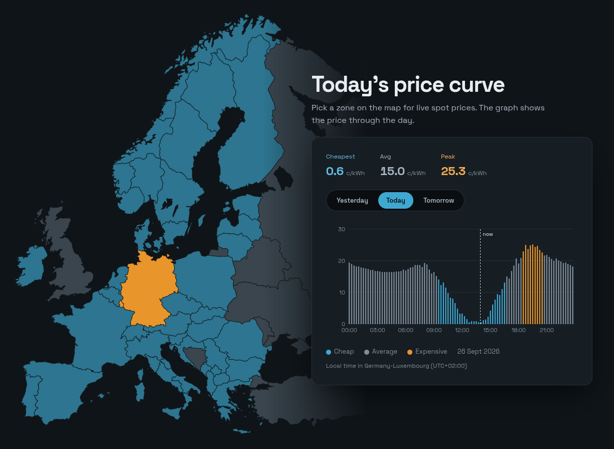
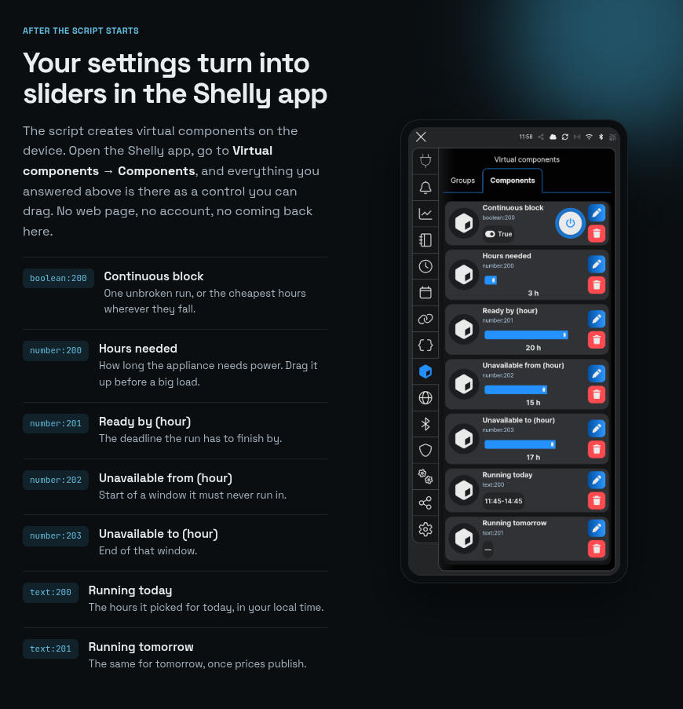
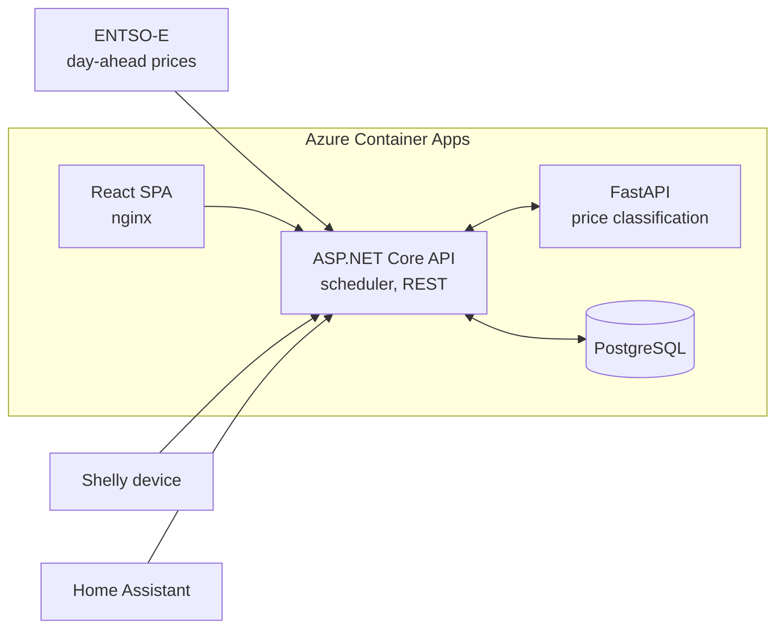

[![Release][release-shield]][release]
[![CI][ci-shield]][ci]
[![License][license-shield]][license]
[![Maintainer][maintainer-shield]][maintainer]

<picture>
  <source media="(prefers-color-scheme: dark)" srcset="docs/logo-dark.png">
  
</picture>

**Runs household appliances in the cheapest hours of the day-ahead electricity market.**<br>
Keep your supplier, keep your devices. SpotSteer is the part that decides when they switch on.

[spotsteer.eu](https://spotsteer.eu) · [Home Assistant integration](https://github.com/hurtamat/spotprice-ha)



## What it does

- **Day-ahead prices for European bidding zones** from ENTSO-E, fetched every afternoon and
  shown on an interactive map in each zone's own local time.
- **Every 15-minute slot classified** as cheap, average or expensive against its own zone's recent
  history, using de-trended quantiles so an expensive week still has cheap hours.
- **A scheduling API.** Ask for "4 hours of power, finished by 06:00" and get the cheapest blocks
  back, either as one continuous run or split. The plan is committed once, never re-optimised
  mid-day, so a device never runs longer than asked.
- **Two device integrations, no hardware to buy.** A Shelly script generated by a web wizard, and a
  Home Assistant integration distributed through HACS.



## Architecture



| Component | Stack | Responsibility |
| --- | --- | --- |
| `spotPriceCalc/` | ASP.NET Core, EF Core, Npgsql | REST API, daily ENTSO-E ingestion, scheduling, rate limiting |
| `calc-service/` | FastAPI, pandas, NumPy | Cheap / expensive cut-offs from de-trended price residuals |
| `frontend/` | React, TypeScript, Vite, MUI X Charts | Zone map, price chart, Shelly setup wizard, guides |
| `scripts/shelly/` | Shelly mJS | On-device scheduler, minified to fit about 8 KB of script heap |
| `infra/` | Terraform, GitHub Actions | Azure resources, OIDC deploys with no stored credentials |

The backend decides and the clients only act: both integrations send the same device-agnostic job
and receive a plan shaped for what they can hold.

## Running locally

```bash
cp .env.example .env        # add your ENTSO-E token
docker compose up --build
```

Frontend on `localhost:3000`, API on `:8080`, calc-service on `:8000`, Postgres on `:5433`. The API
fills its database on startup, so the chart has data after the first run.

Deployment to Azure with Terraform and GitHub Actions is described in [DEPLOYMENT.md](DEPLOYMENT.md).

## License

[MIT](LICENSE). Price data from the [ENTSO-E Transparency Platform](https://transparency.entsoe.eu).

[release-shield]: https://img.shields.io/github/v/release/hurtamat/spotPriceCalc?style=for-the-badge
[release]: https://github.com/hurtamat/spotPriceCalc/releases
[ci-shield]: https://img.shields.io/github/actions/workflow/status/hurtamat/spotPriceCalc/ci.yml?branch=main&style=for-the-badge&label=CI
[ci]: https://github.com/hurtamat/spotPriceCalc/actions/workflows/ci.yml
[license-shield]: https://img.shields.io/github/license/hurtamat/spotPriceCalc?style=for-the-badge
[license]: LICENSE
[maintainer-shield]: https://img.shields.io/badge/maintainer-Matej_Hurta-1B7EA6?style=for-the-badge
[maintainer]: https://github.com/hurtamat
